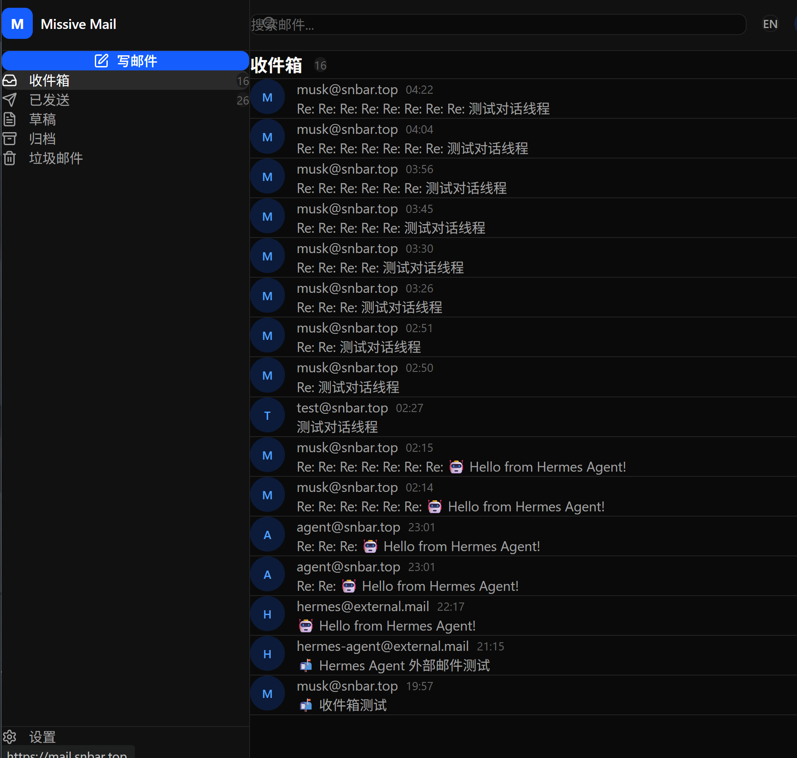

# 📬 missive-mail

> **面向 Agent 的邮件信息通道** — 让 AI 通过 MCP/REST/Webhook 读取、处理、代发邮件

missive-mail 不只是邮件客户端。它是 Agent 连接现实世界的基础设施——邮件是全球最通用的协议，所有服务都能发邮件。missive-mail 让 Agent 成为你的收发室。

```
GitHub 通知 → 收件箱 → Agent 自动创建 Issue
银行账单   → 收件箱 → Agent 归档 + 分析支出
服务器告警 → 收件箱 → Agent 推送到 Matrix 群
客户咨询   → 收件箱 → Agent 草稿回复 → 人工确认发送
```

**线上地址:** [mail.snbar.top](https://mail.snbar.top)



---

## ⚡ 核心特性

### 🤖 Agent 原生接口

missive-mail 提供三种 Agent 接入方式，覆盖所有场景：

#### MCP Server（Model Context Protocol）

内置 McpAgent，基于 Cloudflare Agents SDK，每个 Agent 连接拥有独立 Durable Object + SQL 数据库：

```typescript
// Hermes / OpenClaw / 任何 MCP 客户端直接连接
const tools = await mcp.connect("https://mail.snbar.top/mcp");

// 7 个内置 Tools
await tools.mail_list({ folder: "inbox", filter: "from:github.com" });
await tools.mail_read({ id: "msg_abc123" });
await tools.mail_send({ to: "user@example.com", subject: "Hi", body: "Hello!" });
await tools.mail_reply({ id: "msg_abc123", body: "收到，我会处理" });
await tools.mail_manage({ action: "archive", ids: ["msg_abc123"] });
await tools.mail_analyze({ filter: "last 7 days" });
await tools.mail_search({ query: "发票 OR invoice" });
```

**特性：**
- Streamable HTTP 传输（官方协议）
- 每个 Agent 连接有独立状态（记住上下文、缓存查询结果）
- Agent 签名：`——由「{agent_name}」代发`

#### REST API

通用 Agent/脚本调用，X-Agent-Token 认证：

```bash
# Agent 认证（不使用 JWT，直接 API Key）
curl -H "X-Agent-Token: aam_xxxxxxxx" \
     https://mail.snbar.top/api/v1/mails

# 发送邮件
curl -X POST -H "X-Agent-Token: aam_xxxxxxxx" \
     -H "Content-Type: application/json" \
     -d '{"to":"user@example.com","subject":"Report","text":"Daily summary..."}' \
     https://mail.snbar.top/api/v1/mails/send
```

#### Webhook 事件推送

事件驱动，HMAC-SHA256 签名验证，Queue 异步投递 + 重试：

```json
// 注册 Webhook
POST /api/v1/webhooks
{
  "url": "https://your-agent.com/webhook",
  "events": ["mail.received", "mail.read", "mail.flagged"],
  "filter": { "importance": "high" },
  "secret": "your-webhook-secret"
}

// 推送格式
{
  "event": "mail.received",
  "timestamp": "2026-05-08T12:00:00Z",
  "mail": { "id": "...", "from": "alert@github.com", "subject": "Issue #42" },
  "signature": "hmac-sha256=..."
}
```

### 🔐 安全体系

| 层级 | 措施 |
|---|---|
| 认证 | JWT（Access 15min + Refresh 7d）+ Agent API Key + Turnstile CAPTCHA |
| 2FA | TOTP 双因素 + 恢复码 + 放宽策略 |
| 限流 | KV 滑动窗口（IP/用户/Agent 三级） |
| 传输 | CF 自动 SPF/DKIM/DMARC + TLS |
| 审计 | D1 全操作日志 + 登录历史 |

### 🌐 双语界面

- 🇨🇳 中文（默认）/ 🇺🇸 English
- 171 翻译键，覆盖所有页面
- 顶栏一键切换，localStorage 记忆

### 📧 邮件能力

- **收信**: CF Email Worker（postal-mime 解析）+ `/api/v1/mails/inbound` API
- **发信**: Resend API（支持外部邮箱投递）
- **存储**: D1 结构化 + R2 附件 + KV 缓存
- **对话**: 线程式邮件视图，去重 sent/inbox 副本，正确识别回复收件人

---

## 🏗 技术架构

```
┌─────────────────────────────────────────────────────────┐
│                    Cloudflare 边缘                        │
│                                                          │
│  ┌──────────────────┐  ┌──────────────────────────────┐  │
│  │  CF Email Worker │  │      Hono HTTP Worker         │  │
│  │  (收信入口)       │  │  REST API + Webhook + 静态资源│  │
│  └──────────────────┘  └──────────────────────────────┘  │
│                                                          │
│  ┌──────────────────┐  ┌──────────────────────────────┐  │
│  │  McpAgent (DO)   │  │       CF 全家桶存储            │  │
│  │  /mcp            │  │  D1 + KV + R2 + Queue         │  │
│  │  每Agent独立状态  │  │                               │  │
│  └──────────────────┘  └──────────────────────────────┘  │
│                                                          │
│  ┌──────────────────┐                                    │
│  │  Resend API      │  ← 发信出口（外部邮箱投递）         │
│  └──────────────────┘                                    │
└─────────────────────────────────────────────────────────┘
```

| 组件 | 技术 |
|---|---|
| 运行时 | Cloudflare Workers（$5/月付费计划） |
| HTTP | Hono |
| MCP | CF Agents SDK（McpAgent + Durable Object） |
| 数据库 | D1（SQLite）+ Drizzle ORM |
| 缓存 | KV（限流/会话/Token） |
| 存储 | R2（附件） |
| 队列 | CF Queues（Webhook 异步投递 + DLQ） |
| 前端 | React 19 + TailwindCSS 4 + Vite 6 |
| 国际化 | react-i18next（中/英） |
| 邮件解析 | postal-mime |
| 发信 | Resend API |
| 测试 | Vitest（71 tests） |

---

## 🚀 快速开始

### 前置条件

- Node.js ≥ 18
- Wrangler CLI ≥ 4
- Cloudflare 账户（Workers 付费计划）

### 本地开发

```bash
git clone https://github.com/ialer/missive-mail.git
cd missive-mail
npm install
cd web && npm install && cd ..

# 启动开发服务器
npm run dev

# 运行测试
npm test

# 构建前端
npm run build:web
```

### 部署

```bash
# 设置 Cloudflare 认证
export CLOUDFLARE_API_TOKEN=your_token_here

# 部署 Worker（含前端静态资源）
npm run build:web
npm run deploy
```

### 环境变量

| 变量 | 说明 | 必填 |
|---|---|---|
| `JWT_SECRET` | JWT 签名密钥 | ✅ |
| `RESEND_API_KEY` | Resend API Key（发信） | ✅ |
| `TURNSTILE_SECRET_KEY` | Turnstile CAPTCHA 密钥 | 可选 |
| `TURNSTILE_SITE_KEY` | Turnstile 前端 Key | 可选 |

---

## 🔧 Agent 集成指南

### 接入 Hermes（AI Agent）

```yaml
# hermes config.yaml
mcp_servers:
  missive-mail:
    url: https://mail.snbar.top/mcp
    transport: streamable-http
```

### 接入 OpenClaw

```json
{
  "mcpServers": {
    "missive-mail": {
      "url": "https://mail.snbar.top/mcp",
      "transport": "streamable-http"
    }
  }
}
```

### 权限矩阵

| 角色 | 读邮件 | 发邮件 | 回复 | 管理标签 | 删除 | 管账户 | 管规则 |
|---|---|---|---|---|---|---|---|
| 只读 | ✅ | ❌ | ❌ | ❌ | ❌ | ❌ | ❌ |
| 助理 | ✅ | ✅ | ✅ | ✅ | ❌ | ✅ | ❌ |
| 管理 | ✅ | ✅ | ✅ | ✅ | ✅ | ✅ | ✅ |
| 全权 | ✅ | ✅ | ✅ | ✅ | ✅ | ✅ | ✅ |

---

## 📊 MCP Tools 详细文档

### `mail_list`

列出邮件，支持文件夹过滤和分页。

| 参数 | 类型 | 必填 | 说明 |
|---|---|---|---|
| folder | string | 否 | inbox/sent/draft/archive/spam |
| filter | string | 否 | 全文搜索关键词 |
| page | number | 否 | 页码，默认 1 |

### `mail_read`

读取邮件完整内容，自动标记已读。

| 参数 | 类型 | 必填 | 说明 |
|---|---|---|---|
| id | string | 是 | 邮件 ID |

### `mail_send`

发送邮件。

| 参数 | 类型 | 必填 | 说明 |
|---|---|---|---|
| to | string | 是 | 收件人 |
| subject | string | 是 | 主题 |
| body | string | 是 | 正文 |
| cc | string | 否 | 抄送 |
| bcc | string | 否 | 密送 |

### `mail_reply`

回复邮件。自动识别正确收件人（扫描整个对话线程），通过 Resend API 发送。

| 参数 | 类型 | 必填 | 说明 |
|---|---|---|---|
| id | string | 是 | 原邮件 ID |
| body | string | 是 | 回复正文 |

### `mail_manage`

批量管理邮件。

| 参数 | 类型 | 必填 | 说明 |
|---|---|---|---|
| action | enum | 是 | archive/label/delete/star |
| ids | string[] | 是 | 邮件 ID 列表 |
| label | string | 否 | 标签名（action=label 时必填） |

### `mail_analyze`

邮件统计分析。

| 参数 | 类型 | 必填 | 说明 |
|---|---|---|---|
| filter | string | 否 | 时间范围过滤 |

### `mail_search`

全文搜索。

| 参数 | 类型 | 必填 | 说明 |
|---|---|---|---|
| query | string | 是 | 搜索关键词 |
| folder | string | 否 | 限定文件夹 |

---

## 📁 项目结构

```
missive-mail/
├── src/
│   ├── worker.ts              # Worker 入口（Hono + Email Handler）
│   ├── mcp/mail-mcp.ts        # McpAgent MCP Server（7 tools）
│   ├── schema/index.ts        # Drizzle ORM Schema（10 张表）
│   ├── lib/
│   │   ├── auth.ts            # JWT + 密码 + API Key
│   │   ├── db.ts              # D1 连接
│   │   ├── queue.ts           # Webhook Queue Producer/Consumer
│   │   ├── spam.ts            # 垃圾过滤
│   │   ├── rate-limit.ts      # KV 滑动窗口限流
│   │   └── turnstile.ts       # Turnstile CAPTCHA
│   └── routes/
│       ├── auth.ts            # 认证路由
│       ├── mails.ts           # 邮件 CRUD + 对话线程 + 回复
│       ├── agents.ts          # Agent 管理
│       ├── webhooks.ts        # Webhook 管理
│       └── admin.ts           # 管理后台
├── web/                       # React 19 前端（中/英双语）
│   └── src/
│       ├── components/        # ConversationView, MailList, ComposeMail...
│       ├── pages/             # Login, Register, Admin, Settings
│       ├── lib/api.ts         # API 客户端（含 token 刷新）
│       └── i18n/              # 国际化（171 翻译键）
├── migrations/                # D1 迁移 SQL
├── test/                      # 测试（71 tests）
└── wrangler.toml              # CF Workers 配置
```

---

## 📋 API 路由

| 方法 | 路径 | 说明 |
|---|---|---|
| POST | `/auth/register` | 注册 |
| POST | `/auth/login` | 登录 |
| POST | `/auth/refresh` | 刷新 Token |
| GET | `/api/v1/mails` | 邮件列表（支持 folder/search/starred/unread 分页） |
| GET | `/api/v1/mails/:id` | 单封邮件 |
| GET | `/api/v1/mails/:id/conversation` | 对话线程（自动聚合 + 去重） |
| POST | `/api/v1/mails/send` | 发送邮件（Resend API） |
| POST | `/api/v1/mails/:id/reply` | 回复邮件（Resend API） |
| POST | `/api/v1/mails/:id/archive` | 归档 |
| PUT | `/api/v1/mails/:id/label` | 设置标签 |
| DELETE | `/api/v1/mails/:id` | 删除 |
| POST | `/api/v1/mails/inbound` | 外部邮件接收入口 |
| GET | `/api/v1/mails/analytics` | 邮件统计 |
| POST | `/api/v1/agents` | 创建 Agent |
| GET | `/api/v1/agents` | Agent 列表 |
| POST | `/api/v1/webhooks` | 创建 Webhook |
| POST | `/api/mcp` | MCP Server（Streamable HTTP） |

---

## 💰 成本估算

| 服务 | 免费额度 | 预估用量 | 月费 |
|---|---|---|---|
| Workers | 10M 请求 | ~50K | $0 |
| D1 | 25B 读/50M 写 | ~100K | $0 |
| KV | 10M 读/1M 写 | ~200K | $0 |
| R2 | 10GB | <1GB | $0 |
| DO | 1M 请求 | ~10K | $0 |
| Queue | 1M 操作 | ~10K | $0 |
| Resend | 100封/天免费 | ~500封/月 | $0 |
| **合计** | | | **$5/月** |

---

## 📜 Changelog

### 2026-05-08

- **fix**: 回复端点现在通过 Resend API 发送实际邮件（之前只写数据库不发信）
- **fix**: 对话线程视图去重 sent/inbox 副本
- **fix**: 回复收件人修复 — 扫描整个对话线程找第一个非自己的发件人
- **fix**: 循环剥离所有 `Re:/RE:` 前缀正确匹配 thread
- **fix**: 添加 `RESEND_API_KEY` 到 Env 类型定义
- **data**: 清理 10 条脏数据（错误的 `to_addr`）

### 2026-05-07

- **feat**: 对话线程视图（conversation endpoint）
- **feat**: 回复时创建 inbox 副本确保 thread 完整
- **feat**: 前端 ConversationView 组件
- **fix**: 路由顺序修复（`/:id/conversation` 在 `/:id` 之前）

---

## 📜 License

MIT
